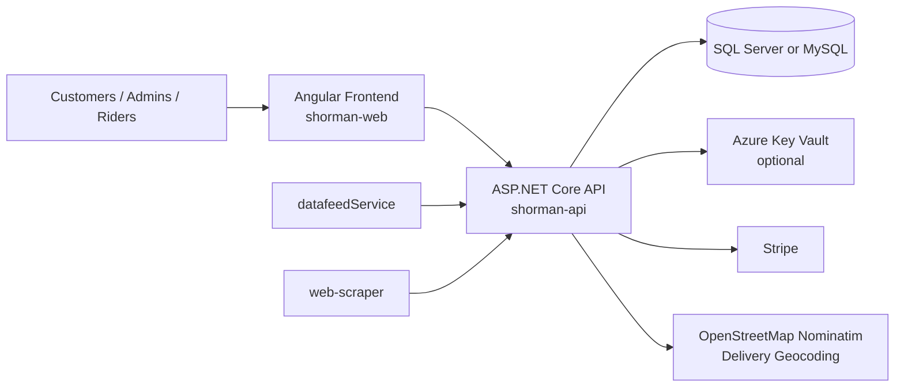
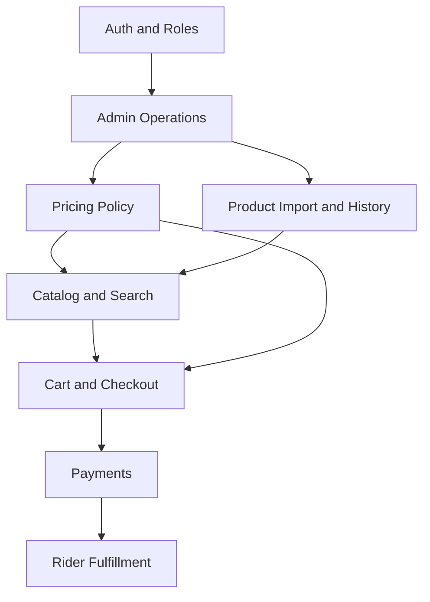
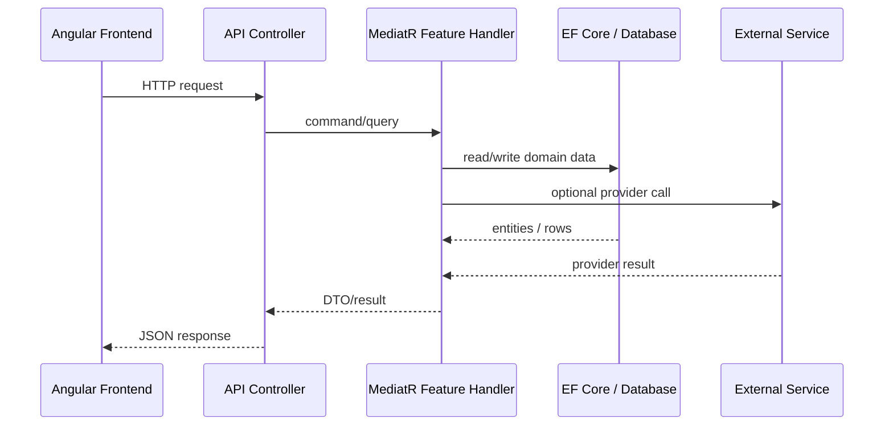
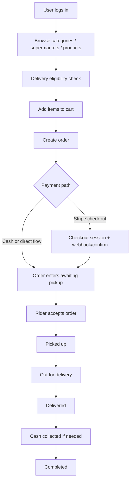
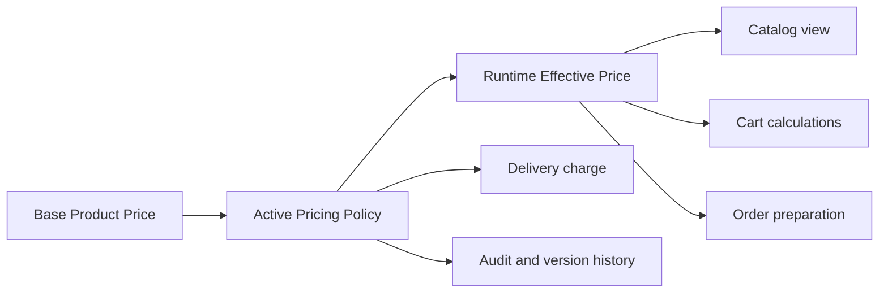
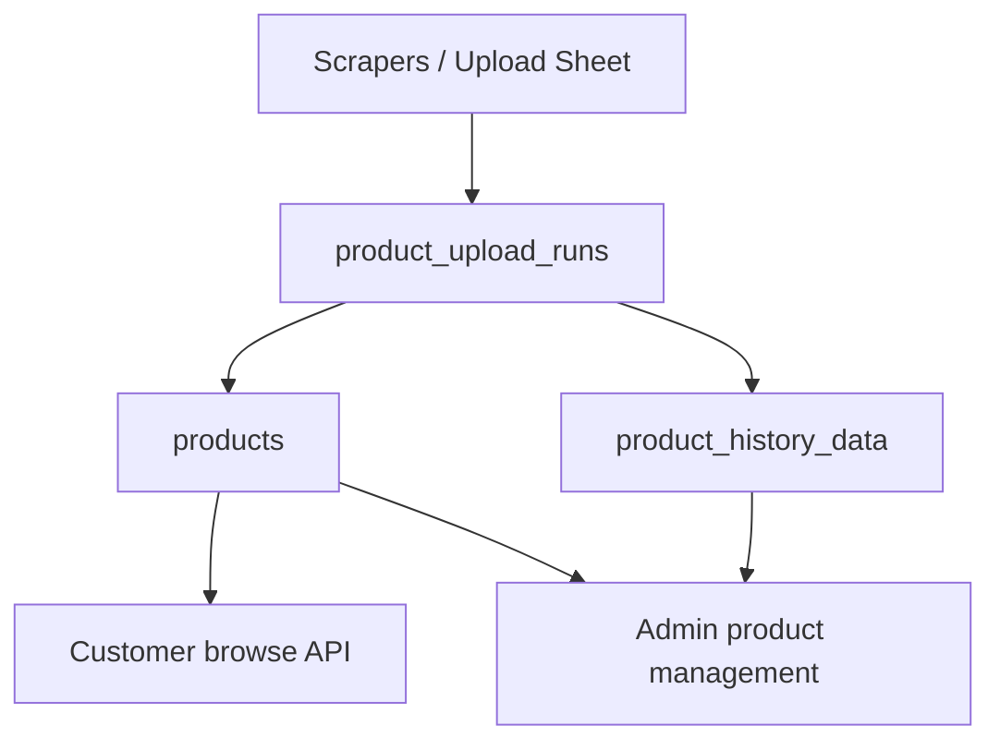

# Shorman Handover Overview

This file is a quick-scan handover guide meant for someone new to the project. It complements the detailed documents by making the architecture easy to understand visually and operationally.

Related docs:

- `DB_ARCHITECTURE.md`
- `PROJECT_EXPLANATION.md`
- `API_ENDPOINTS.md`

## 1. System at a Glance

## 2. Main Business Areas

## 3. Runtime Request Flow

## 4. Commerce Flow

## 5. Pricing Flow

## 6. Catalog Data Flow

## 7. Ownership Map

### Frontend responsibilities

- render customer, admin, and rider experiences
- manage filter/sort state for browsing
- call backend APIs and present DTOs
- handle translations and user session state

### Backend responsibilities

- enforce security and role checks
- implement business rules
- compute pricing and delivery decisions
- persist carts, orders, payment state, and history
- coordinate provider integrations

### Database responsibilities

- store canonical business state
- preserve audit and history data
- support operational reporting and order lifecycle tracking

## 8. Roles in Practice

- `Customer`: browse, manage addresses, use cart, place orders, see insights
- `Admin`: operational catalog/order views and product management
- `Rider`: pickup and delivery lifecycle operations
- `SuperAdmin`: highest privileges, including user role changes, menu permissions, and pricing policy control

## 9. Files to Open First

If someone joins the project and needs a working mental model quickly, this is the best order:

1. `shorman-api/ShormanServicesBackend/Program.cs`
2. `shorman-api/ShormanServicesBackend/Api/DependencyInjection.cs`
3. `shorman-api/ShormanServicesBackend/Api/Persistence/ApiDbContext.cs`
4. `shorman-api/ShormanServicesBackend/Api/Persistence/Entities/ApiEntities.cs`
5. `shorman-api/ShormanServicesBackend/Api/Features/CatalogFeature.cs`
6. `shorman-api/ShormanServicesBackend/Api/Features/OrdersFeature.cs`
7. `shorman-api/ShormanServicesBackend/Api/Features/PricingPolicyFeature.cs`
8. `shorman-web/src/app/features/products/`
9. `shorman-web/src/app/features/checkout/`
10. `shorman-web/src/app/features/orders/`

## 10. Takeover Notes

- The project is beyond prototype level. Pricing, permissions, order state, and product history all already carry production-style design decisions.
- The most important business-specific differentiator is the pricing policy layer that adjusts selling prices without destroying base imported prices.
- The most important operational differentiator is that the system supports customer flow, admin flow, and rider flow in one coherent model.
- The current backend creates schema and indexes during startup, so infrastructure changes should be planned with startup time in mind.
- The current catalog path has already been improved with server-backed pagination, price sorting, targeted indexes, and leaner query patterns.